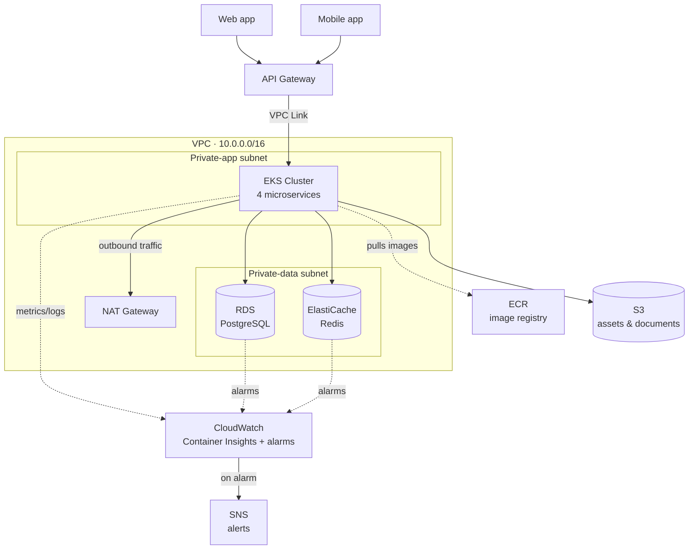

# Microservices Reference Architecture — Terraform

Reference infra for a microservices stack: web + mobile clients → API Gateway →
EKS (4 microservices) → RDS (Postgres) + ElastiCache (Redis), with S3 for
assets/documents. Built as reusable modules + a Terragrunt-composed dev stack.

## Microservices Stack — Architecture Diagram



## Legend

- **Solid arrows** — request/data flow (synchronous)
- **Dashed arrows** — telemetry, image pulls, or alerting (not part of the request path)
- **VPC subgraph** — everything inside runs in private subnets with no direct internet exposure; only NAT Gateway provides outbound-only internet access
- **S3 and ECR** — AWS-managed services that live outside the VPC by design, reached via IAM + (for S3) a VPC Gateway Endpoint

## Structure

```tree
microservices-stack/
├── root.hcl                      # Terragrunt root — generates provider config
├── modules/
│   ├── networking/                # VPC, 3-tier subnets, NAT, routing, security groups
│   ├── eks/                       # EKS cluster + managed node group + OIDC (IRSA)
│   ├── rds/                       # Postgres instance
│   ├── redis/                     # ElastiCache Redis cluster
│   ├── s3/                        # Private assets/documents bucket
│   ├── ecr/                        # Image registry — one repo per microservice
│   ├── monitoring/                 # CloudWatch Container Insights + RDS/Redis alarms
│   └── api-gateway/                # HTTP API + VPC Link + internal NLB into EKS
└── envs/
    └── dev/
        ├── terragrunt.hcl          # Points at ./stack, sets environment = "dev"
        └── stack/                  # Composition root — wires all modules together
```

To add a `prod` environment: copy `envs/dev/` to `envs/prod/`, change
`environment = "prod"` in `terragrunt.hcl`, and adjust variables (e.g.
`multi_az = true` for RDS, more EKS nodes) via `inputs`.

## What each module owns

| Module | Creates | Depends on |
| --- | --- | --- |
| `networking` | VPC, public/private-app/private-data subnets, IGW, NAT, route tables, S3 gateway endpoint, security groups | — |
| `eks` | EKS control plane, managed node group, IAM roles, OIDC provider for IRSA | `networking` |
| `rds` | Postgres instance in the data subnets | `networking` |
| `redis` | ElastiCache Redis in the data subnets | `networking` |
| `s3` | Assets/documents bucket (versioned, encrypted, private) | — |
| `ecr` | One image repository per microservice, with lifecycle policies | — |
| `monitoring` | CloudWatch Container Insights (EKS add-on), SNS alerting, RDS/Redis CPU + storage alarms | `eks`, `rds`, `redis` |
| `api-gateway` | HTTP API, VPC Link, internal NLB + target group | `networking` |

## About the `monitoring` module

Container Insights is installed as a managed EKS add-on
(`amazon-cloudwatch-observability`) — pure Terraform, no Helm required. It
gives you cluster/node/pod CPU, memory, and log aggregation in CloudWatch out
of the box.

For **application-level** observability (per-microservice request rate,
latency, error rate, custom business metrics), most teams pair this with
Prometheus + Grafana deployed inside the cluster via Helm
(`kube-prometheus-stack`) — that's Kubernetes-layer tooling and intentionally
outside this module's scope, similar to how the actual microservice
deployments are.

## Deploying (against real AWS)

```bash
cd envs/dev
terragrunt apply -auto-approve
```

You'll need real AWS credentials configured and should review instance sizes /
`multi_az` / node counts before applying — this reference stack is sized for a
lab environment, not production traffic.

## What you still need to do outside Terraform

- **Deploy the 4 microservices themselves** — this stack provisions the EKS
  *cluster*, not the workloads running on it. Use `kubectl apply`, Helm, or a
  GitOps tool (ArgoCD/Flux) to deploy your service manifests.
- **Install the AWS Load Balancer Controller** (via Helm) inside the cluster
  so Kubernetes Services/Ingresses can register targets with the NLB target
  group this stack creates (`module.api_gateway.target_group_arn`), typically
  via the `TargetGroupBinding` CRD.
- **Path-based routing between the 4 services** (e.g. `/orders/*` →
  orders-service) happens at the Kubernetes Ingress layer, not in API Gateway
  — API Gateway here is a single dumb proxy into the cluster.

## Testing locally with MiniStack — what works and what doesn't

| Service | MiniStack support | Notes |
|---|---|---|
| S3, IAM, STS, API Gateway | ✅ Full (in-memory) | `terraform plan`/`apply`/`destroy` all work normally |
| ECR, CloudWatch, CloudWatch Logs, SNS | ✅ Full (in-memory) | Repository creation, alarms, and topics all work for testing the Terraform code |
| RDS, ElastiCache | ⚠️ Real containers, requires `withRealInfrastructure()` | Needs the Docker socket mounted into MiniStack — see security note below |
| EKS | ⚠️ Control-plane API only | `apply`/`destroy` succeed and validate your Terraform, but **no real worker nodes or pods run** — this is not a substitute for a real or local (kind/minikube) cluster when testing the actual microservices. The `amazon-cloudwatch-observability` add-on in the `monitoring` module depends on a real cluster, so expect it to fail or no-op against MiniStack. |

> ⚠️ **Docker socket risk**: getting real Postgres/Redis containers out of
> MiniStack requires mounting `/var/run/docker.sock` into the MiniStack
> container, which grants it root-equivalent control over your host's Docker
> daemon. Only do this on a local dev machine you trust, never in CI, and
> understand the blast radius before opting in.

**Practical recommendation for this stack**: use MiniStack to validate that
the Terraform for networking, S3, IAM, and API Gateway is syntactically and
structurally correct (`plan`/`apply`/`destroy` cleanly). For RDS, ElastiCache,
and EKS, treat MiniStack as a smoke test for the Terraform code only — do
real integration testing against a real AWS dev account or, for the
Kubernetes workloads specifically, a local cluster like `kind` or `minikube`.
